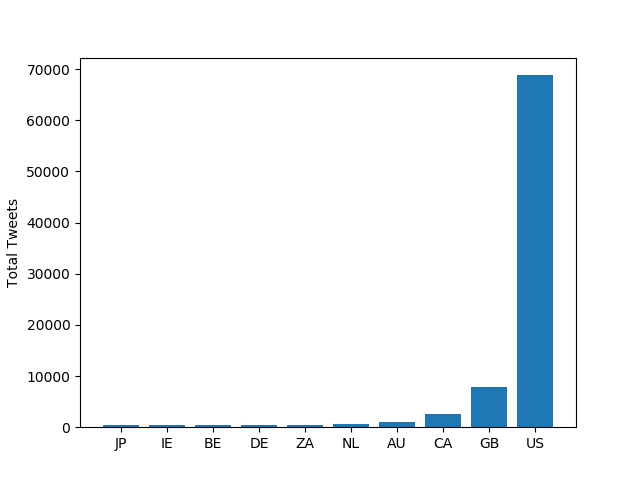
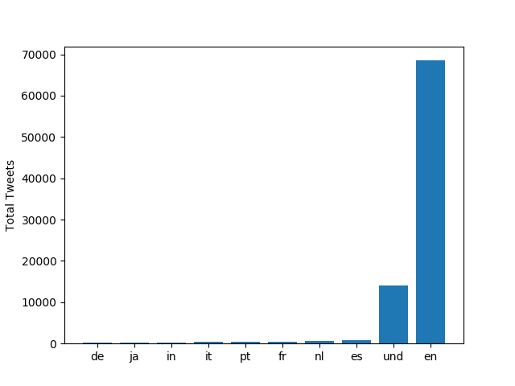
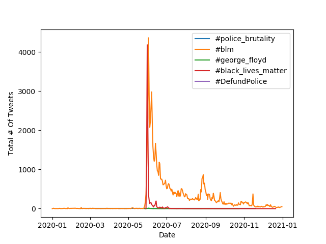

# Extra Credit

This project looks at tweets sent in 2020 which were related to the murder of George Floyd and the subsequent #blm movement. In particular, we will look at from where these tweets were being sent from, what language and how people were using different variations of the hashtag.

# Results

First graph:

```
$ python3 ./src/visualize.py --input_path=reduced.country --key='#blm'
```

Resulting graph:



Second graph:

```
$ python3 ./src/visualize.py --input_path=reduced.lang --key='#blm'
```

Resulting graph:



Third graph:

```
$ python3 ./src/alternative_reduce.py --keys '#police_brutality' '#blm' '#george_floyd' '#black_lives_matter' '#DefundPolice'
```

Resulting graph:


